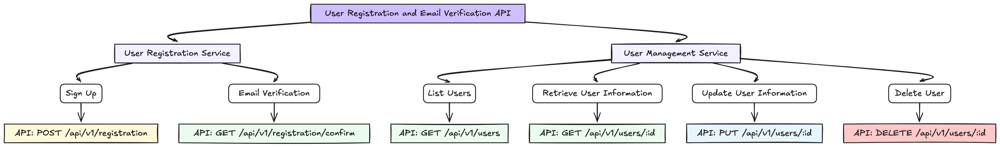
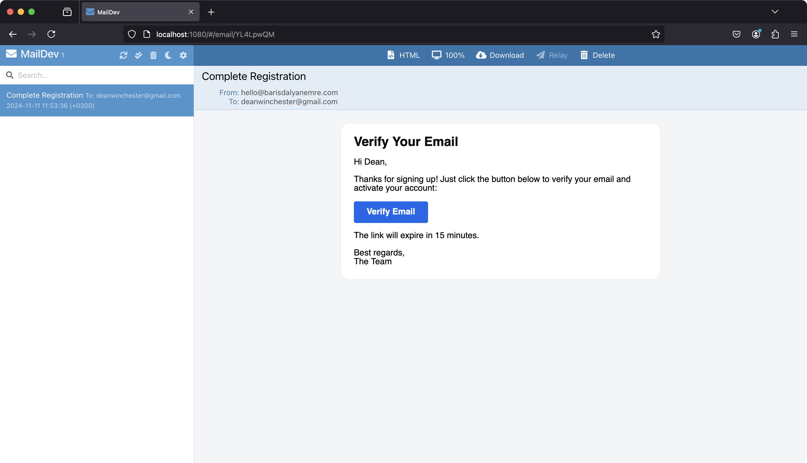

# User Registration and Email Verification RESTful API with Spring Boot

This project is a **Spring Boot-based RESTful API** designed to handle **user registration** and **email verification** processes. The application allows users to create accounts, verifies their email addresses, and manages user information securely. Key features include:

- **User Registration**: New users can sign up with essential information, securely stored in a PostgreSQL database.
- **Email Verification**: After registration, an email with a verification token is sent to the user, allowing them to confirm and activate their account.
- **User Management**: CRUD operations for managing user profiles and account details.
- **Exception Handling**: Custom error responses ensure robustness.

<p  align="center">

</p>

## How to Use

### Clone the Repository

To start working with this project, you'll need to clone the repository to your local machine. Use the following commands to download the project and navigate into its directory:

```bash
git clone https://github.com/barisdalyan/user-registration-email-verification.git
cd user-registration-email-verification
```

### Configure Environment Variables

Create a `.env` file in the project root with the following placeholders to set up database and application configuration:

```
# Database credentials
POSTGRES_USER=user
POSTGRES_PASSWORD=password
POSTGRES_DB=user_registration

# Application database configuration
DATABASE_URL=jdbc:postgresql://localhost:5432/user_registration
DATABASE_USERNAME=user
DATABASE_PASSWORD=password
```

> **Note:** Ensure that the username, password, and database name match in both the database credentials and the application database configuration.

## Run the Project with Docker Compose

Docker Compose simplifies starting and stopping the application, PostgreSQL database, and MailDev email service as defined in the `docker-compose.yml` file.

### Step 1: Start the Database and Mail Services

First, start only the `maildev` and `db` services. This allows you to have the required dependencies running without starting the app service, which depends on the .jar file:

```bash
docker-compose up -d maildev db
```

### Step 2: Build the Application

You can now build the application:

```bash
./mvnw package
```

This command will compile the code and place the .jar file in the target folder.

### Step 3: Update the Database URL

Before starting the app service, ensure the database connection URL is correctly configured. In the `.env` file, update the line:

```bash
DATABASE_URL=jdbc:postgresql://localhost:5432/user_registration
```

to

```bash
DATABASE_URL=jdbc:postgresql://db:5432/user_registration
```

This change points the application to the `db` service defined in `docker-compose.yml` instead of `localhost`.

### Step 4: Start the Application Service

After updating the `.env` file and successfully building the .jar, you can start the app service with:

```bash
docker-compose up -d app
```

### Stop the Project

To stop the project and remove containers and associated resources, use:

```bash
docker-compose down
```

This setup provides a fully integrated environment, with all services configured to work together seamlessly.

## User Registration Service ([RegistrationController.java](src/main/java/com/barisdalyanemre/userregistrationemailverification/controllers/RegistrationController.java))

This service is responsible for handling user registration and email verification functions.

### API Endpoints

| Method | Endpoint                     | Description                                                      |
|--------|-------------------------------|------------------------------------------------------------------|
| `POST` | `/api/v1/registration`        | Creates a new user registration and sends a verification email   |
| `GET`  | `/api/v1/registration/confirm`| Confirms the email verification token to complete registration   |

### User Registration and Verification Workflow

- **Sign Up (`POST /api/v1/registration`)**: Receives user details to initiate the registration process. After validating a valid email address, a verification email with a link is sent to the user.
- **Email Verification (`GET /api/v1/registration/confirm`)**: The token sent to the user is verified through the link, activating the user’s account.

## User Management Service ([UserController.java](src/main/java/com/barisdalyanemre/userregistrationemailverification/controllers/UserController.java))

This service handles CRUD (Create, Read, Update, Delete) operations for user management.

### API Endpoints

| Method   | Endpoint                  | Description                         |
|----------|----------------------------|-------------------------------------|
| `GET`    | `/api/v1/users/`           | Retrieves all users                 |
| `GET`    | `/api/v1/users/{id}`       | Retrieves a single user by ID       |
| `PUT`    | `/api/v1/users/{id}`       | Updates user details by ID          |
| `DELETE` | `/api/v1/users/{id}`       | Deletes a user by ID                |

### User Management Workflow

- **Listing Users**: Lists all users at `/api/v1/users/`.
- **Retrieving User Information**: Gets specific user details at `/api/v1/users/{id}`.
- **Updating User**: Updates user details via the `/api/v1/users/{id}` endpoint.
- **Deleting User**: Deletes the specified user by ID at `/api/v1/users/{id}`.

---



## License

This project is released under the MIT License.
